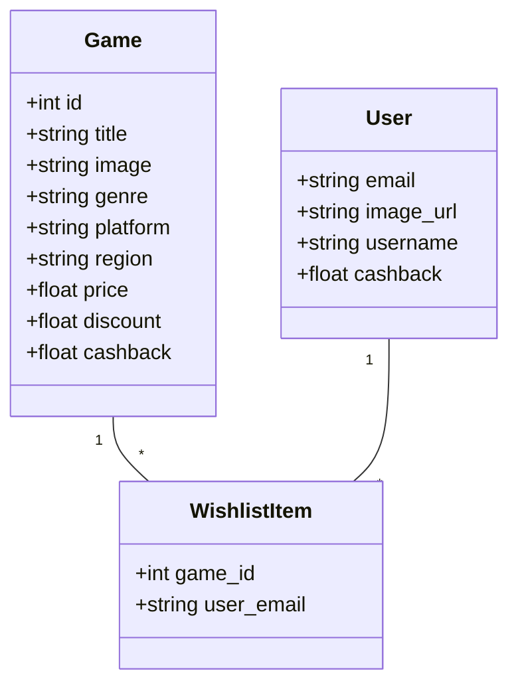

# Game Search Web Application

This repository contains a small full-stack web application that implements a searchable game catalog.
The application was built as part of a technical assignment and follows the provided design and API requirements.

## Overview

<p align="center">
  
</p>

TODO: fix the class diagram based on current implementation



The application allows users to search for games using partial matches [and typo-tolerant search (CONSIDERATION)].

It consists of:
- React frontend (UI matching the provided screenshot)
- Node.js backend (Express)
- SQLite database

The dataset includes (at minimum):
- FIFA 23
- Red Dead Redemption 2
- Split Fiction
Additional game entries were added to better demonstrate search behaviour.

## Tech Stack

__Frontend__ (TODO: fix the frontend based on implementation, not started yet)
- React
- Fetch API for backend communication
- Responsive layout based on the provided design screenshot

__Backend__
- Node.js (Express)
- SQLite (via sqlite3)

__Database__
- SQLite

## Public API
The backend exposes the following public endpoints:

---
```
GET /list
```
Returns a list of all available games.

---
```
GET /list?search=<gamename>
```
Returns games matching the search query.
Supports partial matches
Supports typo-tolerant search (CONSIDERATION)

---

## Search Implementation (Fuzzy Search)
https://www.meilisearch.com/blog/fuzzy-search
TODO: decide on the way of implementation
> lavenshtein distance algorithm, hamming distance (for typos support)
> substring search (easiest implementation)

## Database schema
TODO: insert database schema

## Deployment
TODO: deployment
> Microsoft Azure
> Docker Compose

## AI Usage & Prompt History
TODO: specify the AI usage
